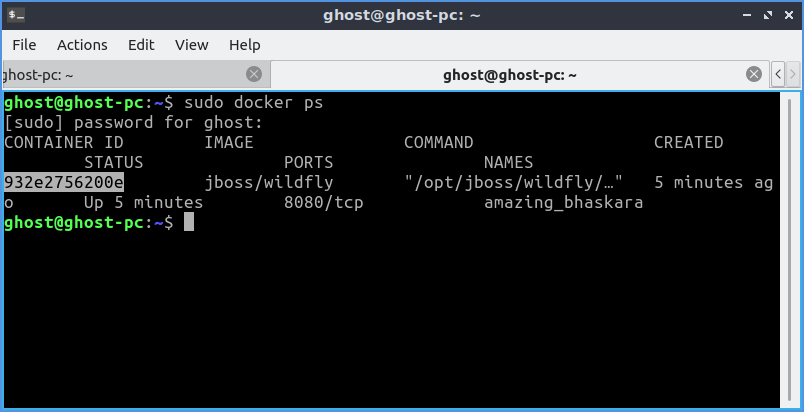

# Wildfly-docker

>Orginal Tutorial Link:
http://www.mastertheboss.com/soa-cloud/docker/getting-started-with-docker-and-wildfly

http://www.mastertheboss.com/soa-cloud/docker/deploying-applications-on-your-docker-wildfly-image

>Pulling Docker images
```
    $ sudo docker pull jboss/wildfly
```

>List Docker images
```
    $ sudo docker images
```

>In order to start the wildfly application server, simply issue:
```
    $ sudo docker run -it jboss/wildfly
```

>Seems the server started correclty. We can check it by issuing the docker ps command which retrieves the images process which are running and the ports engaged by the process:
```
  $ sudo docker ps
```

>If you have notices the startup log of the server, you should have discovered that the server is located in the /opt/jboss/wildfly and that by default the public interfaces are bound to the 0.0.0.0 address whilst the admin interfaces are bound just to localhost. This information will be useful to learn how to customize the server.

>So, in order to access to our wildfly server, we need to know which address has been chosen by the application server for socket binding. We will use the docker inspect command passing as parameter the ID of the Container we have already found (932e2756200e):




```
  $ sudo docker inspect -f '{{ .NetworkSettings.IPAddress }}' 932e2756200e
```

## Creating docker file
>Dockerfile? a Dockerfile has a special mission: automation of Docker image creation. Once, you write build instructions into Dockerfile, you can build your own Docker images with custom environment configuration.
