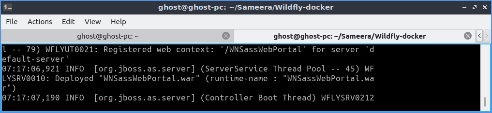
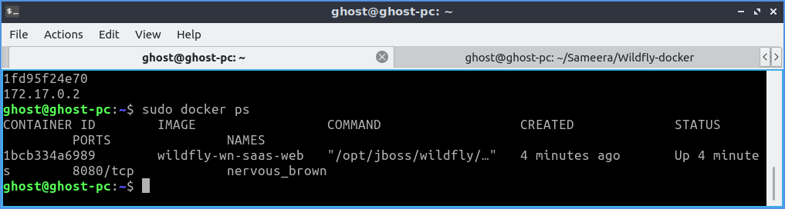
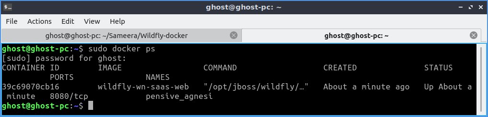
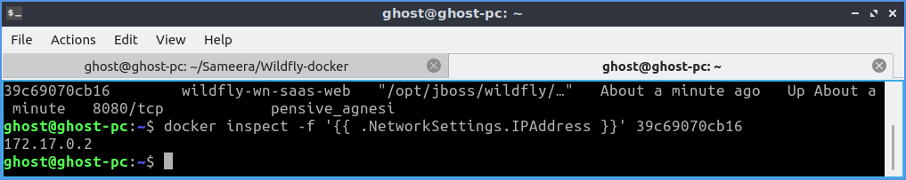

# Wildfly-docker

>Original Tutorial Link:
http://www.mastertheboss.com/soa-cloud/docker/getting-started-with-docker-and-wildfly

http://www.mastertheboss.com/soa-cloud/docker/deploying-applications-on-your-docker-wildfly-image

>Note: Following read me created by using above links for my personal guidance. Big thanks for mastertheboss

>Pulling Docker images
```
    $ sudo docker pull jboss/wildfly
```

>List Docker images
```
    $ sudo docker images
```

>In order to start the wildfly application server, simply issue:
```
    $ sudo docker run -it jboss/wildfly
```

>Seems the server started correctly. We can check it by issuing the docker ps command which retrieves the images process which are running and the ports engaged by the process:
```
  $ sudo docker ps
```

>If you have notices the startup log of the server, you should have discovered that the server is located in the /opt/jboss/wildfly and that by default the public interfaces are bound to the 0.0.0.0 address whilst the admin interfaces are bound just to localhost. This information will be useful to learn how to customize the server.

>So, in order to access to our wildfly server, we need to know which address has been chosen by the application server for socket binding. We will use the docker inspect command passing as parameter the ID of the Container we have already found (932e2756200e):


```
  $ sudo docker inspect -f '{{ .NetworkSettings.IPAddress }}' 932e2756200e
```

## Creating docker file
>Dockerfile? a Dockerfile has a special mission: automation of Docker image creation. Once, you write build instructions into Dockerfile, you can build your own Docker images with custom environment configuration.

>Now make sure that the WNSassWebPortal.war application is in the same folder as the Dockerfile

>To build a new Docker image is pretty simple, you have to choose a name (actually a tag) and issue a docker build command:

```
  $ sudo docker build --tag=wildfly-wn-saas-web .
```

>So we have successfully built the wildfly-wn-saas-web image. Let's check it by issuing a docker images command:
```
  $ sudo docker images
```

>So now you can start Docker with just:
```
  $ sudo docker run -it wildfly-wn-saas-web
```

>The application server will start. Verify that the console that the application has been started:



>Fine, in order to test it, we need to find the IP address which has been chosen by Docker to bind the application server:
```
  $ sudo docker ps
```



>And then:
```
  $ sudo docker inspect -f '{{ .NetworkSettings.IPAddress }}' 1bcb334a6989
```

>Application is ready to be tested at the address

  http://172.17.0.2:8080/WNSassWebPortal


## Deploying applications using the Web Admin console

>In order to deploy applications using the Web console we will need to add an user with add-user.sh script which is included in the bin folder of the application server. There are several way to do that, but we can have it done while building our image, so let's add to our Dockerfile the following command which will create an user in non interactive mode:

```
FROM jboss/wildfly

RUN /opt/jboss/wildfly/bin/add-user.sh admin Admin#70365 --silent
```

>Now let's rebuild our image:
```
  $ sudo docker build --tag=wildfly-wn-saas-web .
```

>We will start now the application server. Since we need to access the management interfaces from our host machine, we need to bind them as well on the 0.0.0.0 IP (all available IP Addresses).
```
  $ sudo docker run -it wildfly-wn-saas-web /opt/jboss/wildfly/bin/standalone.sh -b 0.0.0.0 -bmanagement=0.0.0.0
```

>Fine. Inspect for the Container ID using docker ps and find the IP Address used by the application server



> And then:
```
  $ docker inspect -f '{{ .NetworkSettings.IPAddress }}' 39c69070cb16
```



>Now log into the Admin Web console at 172.17.0.2:9990 and enter the credentials we have included into the Dockerfile. In here,
```
user name: admin
password: Admin#70365
```
>Great! we are into the Docker Admin Console.

>From there we can access the Runtime tab and add applications which are hosted on our machine.

## Further customization of the Docker file

>So far we have learned about the RUN command to execute the add-user.sh script. We will learn another command which is CMD. The main purpose of a CMD is to provide defaults for an executing container.

```
CMD ["/opt/jboss/wildfly/bin/standalone.sh", "-b", "0.0.0.0", "-bmanagement", "0.0.0.0"]
```

>The advantage of including this command in the Docker images is that we don't need to specify every time the port bindings.

> By the way, what is the difference between RUN and CMD ? With RUN the docker build will execute the commands. With CMD docker run will run this command by default.

>So here is the full Dockerfile:

```
FROM jboss/wildfly

RUN /opt/jboss/wildfly/bin/add-user.sh admin Admin#70365 --silent

CMD ["/opt/jboss/wildfly/bin/standalone.sh", "-b", "0.0.0.0", "-bmanagement", "0.0.0.0"]
```

>Once you have rebuilt your image, you can start your docker image with just:
```
  $ sudo docker build --tag=wildfly-wn-saas-web .
  $ sudo docker run -it wildfly-wn-saas-web
```
